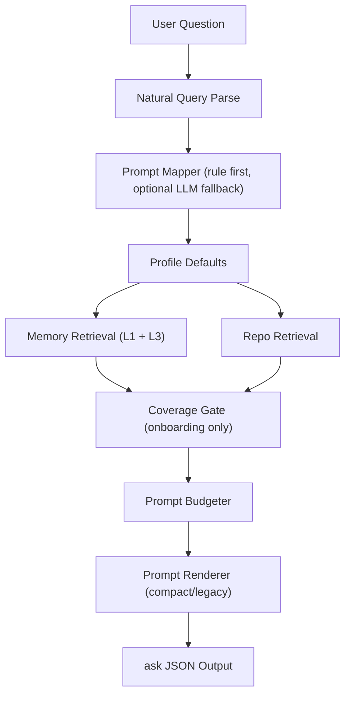

# Architecture

## System Overview

`dev-mem` is a local-first memory system with four planes:
1. capture plane (lifecycle write path)
2. retrieval plane (search/timeline/get-observations)
3. ask orchestration plane (mapping, coverage, budgeting, rendering)
4. integration plane (MCP + web APIs)

## 6-Layer Runtime (Current PMF Shape)

`dev-mem` now exposes an explicit six-layer runtime contract for developer workflows:

1. `access_ux`
2. `task_compiler_plan`
3. `memory_ingestion_structuring`
4. `storage_index`
5. `retrieval_ranking`
6. `execution_critic_delivery`

The output payload from `ask` includes:
- `task_spec`
- `execution_plan`
- `coverage_9_section`
- `evidence_stats`
- `executor_mode`
- `execution_attempted`
- `execution_result`

Additional runtime safeguards:
- graph-lite edge persistence (`graph_lite_edges` table) for local neighbor priors
- onboarding coverage recovery loop (`coverage_retry_max`) before finalizing gate result
- execution critic guard (`stuck_detected`, `risk_level`, recommendation)

## Ask Pipeline (Current)

`ask` in `Scripts/codex_mem.py` executes:
1. natural-language parse (`parse_natural_query`)
2. prompt profile mapping (`prompt_mapper.py`)
3. profile defaults application (`prompt_profiles.py`)
4. memory retrieval (Layer 1 + Layer 3 detail pull)
5. repo retrieval (`repo_knowledge.py`)
6. coverage gate for onboarding profile (`entrypoint`, `persistence`, `ai_generation`)
7. prompt budgeting (`prompt_budgeter.py`)
8. rendering (`prompt_renderer.py` for compact or legacy renderer fallback)

## Core Modules

- `Scripts/codex_mem.py`
  - CLI entrypoint and DB operations
  - fused ask orchestration and output assembly
- `Scripts/prompt_profiles.py`
  - profile registry, defaults, coverage requirements, budget ratios
- `Scripts/prompt_mapper.py`
  - rule scoring + optional OpenAI fallback routing
- `Scripts/prompt_budgeter.py`
  - evidence dedupe, token estimation, budgeted evidence selection
- `Scripts/prompt_renderer.py`
  - compact prompt section renderer
- `Scripts/repo_knowledge.py`
  - code indexing and repo evidence retrieval
- `Scripts/codex_mem_mcp.py`
  - MCP schema + CLI bridging for mem tools

## Data Stores

- SQLite (`.codex_mem/memory.db`)
  - `sessions`, `events`, `observations`, FTS tables, `meta`
- local repo index (`.codex_knowledge` by default)

## Coverage Gate Design

Coverage gate is profile-aware:
- enforced categories only for `onboarding`
- missing categories trigger narrow second-pass repo probes
- if still missing, output flags incomplete state explicitly (`coverage_gate.pass=false`)

This prevents falsely complete summaries when evidence is insufficient.

## Output Contract (ask)

Core payload:
- `layer1_search`, `layer3_observations`, `repo_context`
- `suggested_prompt`, `token_estimate`

New decision/quality payload:
- `mapping_decision`
- `coverage_gate`
- `prompt_plan`
- `prompt_metrics`

## Isolation and CI Guard

- `Scripts/check_domain_isolation.py` blocks banned cross-domain terms.
- `.github/workflows/domain-isolation.yml` runs this check on PR/push.
