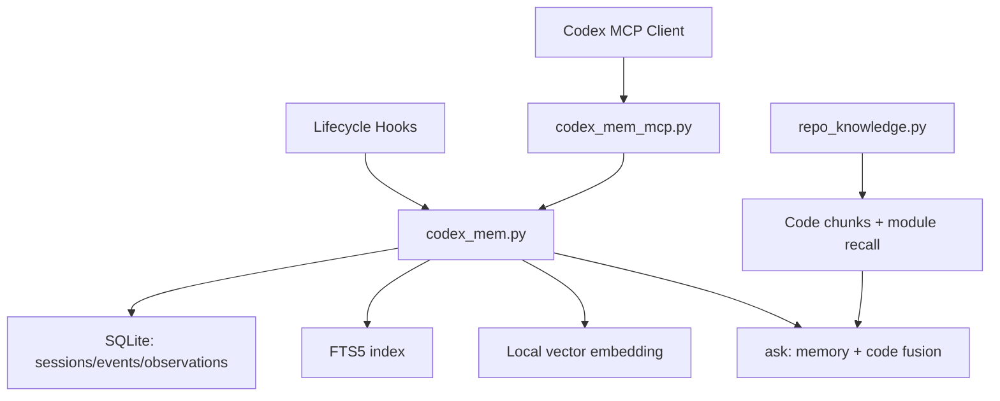

# codex-mem

Persistent memory + progressive retrieval system built for **Codex**.

`codex-mem` gives Codex long-term, local-first memory across sessions and combines that memory with repository retrieval so follow-up answers are faster, cheaper, and more accurate.

## Why this exists

Most coding sessions fail at continuity:
- New chat starts with no operational memory.
- The same architecture context gets repeated.
- Expensive context stuffing burns tokens.

`codex-mem` solves this with:
1. **Lifecycle capture** (what happened during work)
2. **Progressive retrieval** (retrieve only what is needed)
3. **Memory + code fusion** (memory history + real repo evidence)

## Feature Matrix

- **Local-first persistence**: SQLite + FTS5 + lightweight local semantic vectors
- **5 lifecycle hooks**: `session-start`, `user-prompt-submit`, `post-tool-use`, `stop`, `session-end`
- **3-layer retrieval**:
  - Layer 1: `search` (compact index)
  - Layer 2: `timeline` (temporal context)
  - Layer 3: `get-observations` (full details)
- **Codex MCP server**: `Scripts/codex_mem_mcp.py`
- **Skill package**: `Skills/codex-mem/`
- **Repo fusion retrieval**: `ask` calls memory + `repo_knowledge`
- **Tool output compaction**: optional deterministic compaction for heavy logs
- **Privacy tag blocking**: skip memory writes with `no_mem/private/sensitive/secret`
- **Smoke test**: CLI + MCP end-to-end simulation

## Table of Contents

- [Quick Start](#quick-start)
- [How It Works](#how-it-works)
- [Architecture](#architecture)
- [CLI Commands](#cli-commands)
- [MCP Tools](#mcp-tools)
- [Skill Integration](#skill-integration)
- [Token Strategy](#token-strategy)
- [Privacy and Data Model](#privacy-and-data-model)
- [Validation](#validation)
- [Roadmap](#roadmap)
- [Documentation](#documentation)
- [Troubleshooting](#troubleshooting)
- [Contributing](#contributing)
- [License](#license)

## Quick Start

### 1) Initialize local memory

```bash
bash Scripts/codex_mem.sh init --project demo
```

### 2) Simulate a session lifecycle

```bash
bash Scripts/codex_mem.sh session-start s1 --project demo --title "Session 1"
bash Scripts/codex_mem.sh prompt s1 "Read architecture and map data flow" --project demo
bash Scripts/codex_mem.sh tool s1 shell "rg -n 'HomeStreamOrchestrator'" --project demo --title "Locate orchestrator" --compact
bash Scripts/codex_mem.sh stop s1 --project demo --content "Checkpoint"
bash Scripts/codex_mem.sh session-end s1 --project demo
```

### 3) Retrieve memory progressively

```bash
# Layer 1
bash Scripts/codex_mem.sh search "orchestrator streaming" --project demo --limit 20

# Layer 2
bash Scripts/codex_mem.sh timeline E12 --before 5 --after 5

# Layer 3
bash Scripts/codex_mem.sh get E12 O3
```

### 4) Fuse memory + repo retrieval

```bash
bash Scripts/codex_mem.sh ask "What is the end-to-end streaming update path?" --project demo
```

## How It Works

### Lifecycle capture

`codex-mem` records events at operational boundaries:

1. **SessionStart**: session opened
2. **UserPromptSubmit**: user intent captured
3. **PostToolUse**: command/tool output captured (optionally compacted)
4. **Stop**: checkpoint marker
5. **SessionEnd**: close + auto summary + observation generation

### Progressive disclosure retrieval

Instead of stuffing full history into every prompt:

1. **`search`** returns compact candidates (ID/title/type/score)
2. **`timeline`** returns neighborhood around selected IDs
3. **`get-observations`** returns full details for final IDs only

### Fused answer context

`ask` merges:
- Memory context (`search` + `get-observations`)
- Repository context (`repo_knowledge.py query --json`)

This keeps context windows small while preserving factual grounding.

## Architecture



Key implementation files:
- `Scripts/codex_mem.py`
- `Scripts/codex_mem_mcp.py`
- `Scripts/repo_knowledge.py`
- `Scripts/codex_mem_smoketest.py`

## CLI Commands

### Core

```bash
bash Scripts/codex_mem.sh init [--project NAME]
bash Scripts/codex_mem.sh session-start <session_id> [--project NAME] [--title TEXT]
bash Scripts/codex_mem.sh prompt <session_id> "<user prompt>" [--project NAME]
bash Scripts/codex_mem.sh tool <session_id> <tool_name> "<tool output>" [--project NAME] [--compact]
bash Scripts/codex_mem.sh stop <session_id> [--project NAME]
bash Scripts/codex_mem.sh session-end <session_id> [--project NAME] [--skip-summary]
```

### Retrieval

```bash
bash Scripts/codex_mem.sh search "<query>" [--project NAME] [--session-id SID] [--limit N]
bash Scripts/codex_mem.sh timeline <E123|O45> [--before N] [--after N]
bash Scripts/codex_mem.sh get <E123|O45> [more IDs]
bash Scripts/codex_mem.sh ask "<question>" [--project NAME]
```

### MCP mode

```bash
bash Scripts/codex_mem.sh mcp --project-default demo
```

## MCP Tools

`codex_mem_mcp.py` exposes the following tools:

| Tool | Purpose |
|---|---|
| `mem_search` | Layer-1 compact retrieval |
| `mem_timeline` | Layer-2 temporal context |
| `mem_get_observations` | Layer-3 full detail retrieval |
| `mem_ask` | Memory + repo fused retrieval |
| `mem_session_start` | Lifecycle start hook |
| `mem_user_prompt_submit` | Prompt submission hook |
| `mem_post_tool_use` | Tool output capture hook |
| `mem_stop` | Stop/checkpoint hook |
| `mem_session_end` | Session close hook + optional summary |
| `mem_summarize_session` | Regenerate session summary |

### Register MCP in Codex

```bash
codex mcp add codex-mem -- python3 /ABS/PATH/codex-mem/Scripts/codex_mem_mcp.py --root /ABS/PATH/codex-mem --project-default demo
```

## Skill Integration

Skill package location:
- `Skills/codex-mem/SKILL.md`
- `Skills/codex-mem/agents/openai.yaml`

The skill defines:
- recommended retrieval sequence
- MCP connection shape
- lifecycle hook usage policy

## Token Strategy

The system optimizes token usage by design:

1. **Compact first**: IDs/titles before details
2. **Selective expansion**: timeline around only selected items
3. **Late full fetch**: full observation only when necessary
4. **Optional tool compaction**: large command outputs can be compressed before storage
5. **Repo fusion by top-k**: code snippets are bounded by `code_top_k` and module recall limit

## Privacy and Data Model

### Local data

All memory is local in:
- `<repo>/.codex_mem/codex_mem.sqlite3`

### Tables

- `sessions`
- `events`
- `observations`
- `events_fts`
- `observations_fts`

### Blocking sensitive writes

`post-tool-use` skips write when tags include one of:
- `no_mem`
- `private`
- `sensitive`
- `secret`

## Validation

### Smoke test

```bash
python3 Scripts/codex_mem_smoketest.py --root .
```

This validates:
- CLI lifecycle capture
- Layered retrieval behavior
- MCP initialization + tools/list + tools/call
- At least one non-empty retrieval path

### Example smoke output (abridged)

```json
{
  "ok": true,
  "summary_event_count": 4,
  "search_result_count": 5,
  "mcp_tools_verified": [
    "mem_ask",
    "mem_get_observations",
    "mem_search",
    "mem_timeline"
  ]
}
```

## Roadmap

- Optional web viewer for memory stream and observation inspection
- Optional external embedding providers for larger semantic recall
- Incremental indexing modes for very large monorepos
- Prebuilt install scripts for one-command setup
- CI package and release automation

## Documentation

- `Documentation/CODEX_MEM.md` - detailed operational guide
- `Documentation/INSTALLATION.md` - setup and environment guidance
- `Documentation/MCP_TOOLS.md` - tool schemas and call patterns
- `Documentation/ARCHITECTURE.md` - component and data-flow model
- `Documentation/TROUBLESHOOTING.md` - common failure modes
- `PUBLISH.md` - GitHub publishing workflow

## Troubleshooting

- **`Repository not found` on push**
  - Check repo exists and PAT has access to that repo.
- **MCP stream closes immediately**
  - Ensure `Scripts/codex_mem.py` exists under `--root`.
- **No search results**
  - Verify lifecycle events were written for the same `--project`/`session_id`.
- **Permission errors in protected directories**
  - Run in user-writable location and avoid system-protected paths.

## Contributing

1. Create branch from `codex/init`
2. Keep changes local-first and testable via smoke test
3. Add docs for every new CLI/MCP behavior
4. Include before/after command examples in PR description

## License

This repository currently has no explicit open-source license file.
Add one before broad public distribution.
